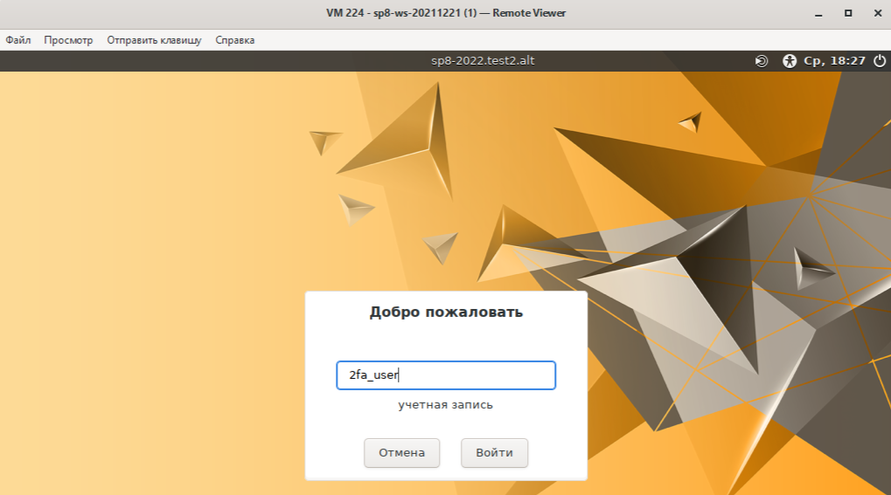
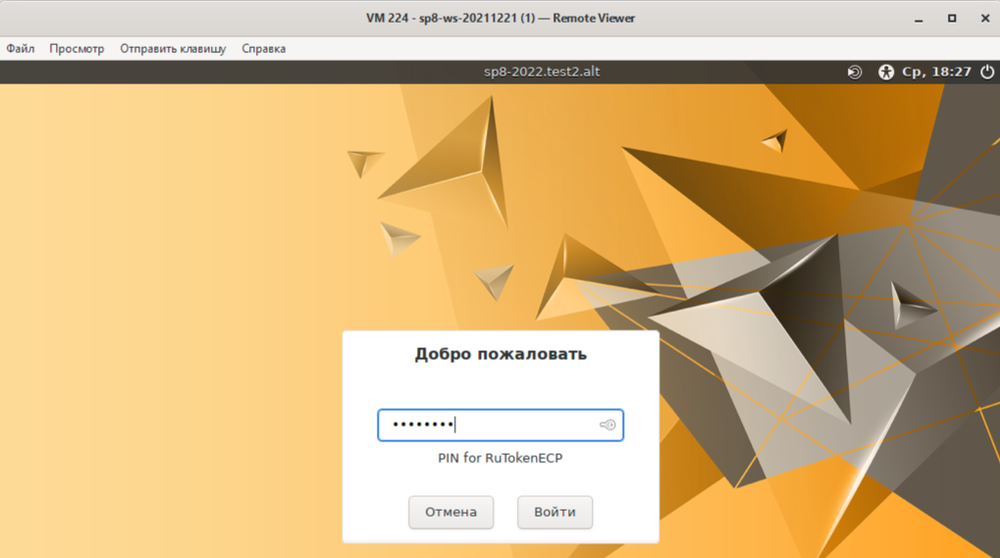
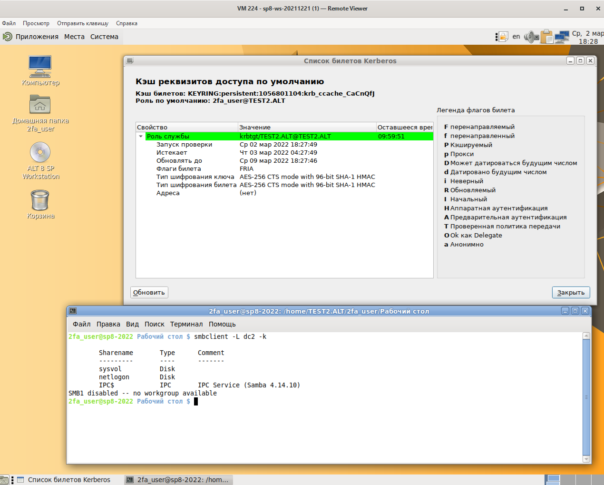
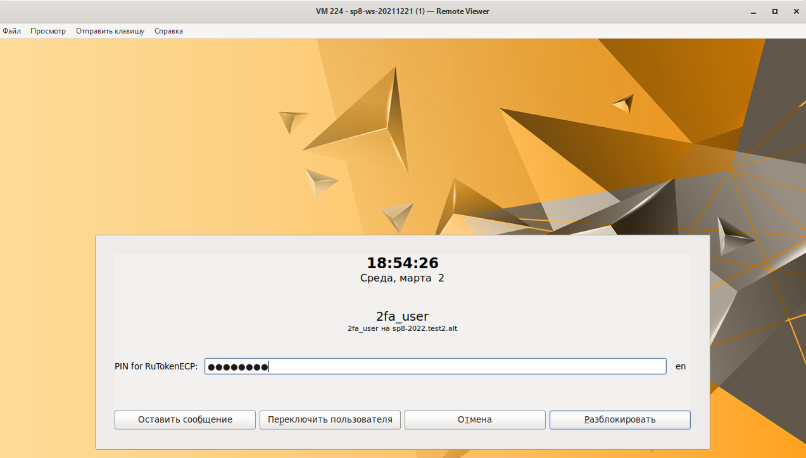

= 2ФА в домене Samba AD
:toc:
:toc-title: Оглавление
:toclevels: 4

<<<

== Описание стенда

Инструкция подготовлена для следующего стенда: +
- Контроллер домена на базе ОС Альт 8СП Сервер (ИК 2022, repo c9f2) +
- Рабочая станция на базе ОС Альт 8СП Рабочая станция (ИК 2022, repo c9f2) +
- Доменная двухфакторная аутентификация (2ФА) по токену (Рутокен ECP 2.0 2000) +

== Контроллер домена (DC)

Контроллер домена настроен по инструкции https://altsp.su/export/sites/altsp/.galleries/documentation/fstek/lknv.11100-01-90-01-rukovodstvo-administratora.pdf, *п.9.1.1. Samba 4 в роли контроллера домена Active Directory* или https://www.altlinux.org/ActiveDirectory/DC

=== Проверка работоспособности Samba AD

[source,shell,subs="verbatim,quotes"]
----
dc2 ~ # *samba-tool domain info 127.0.0.1*
Forest           : test2.alt
Domain           : test2.alt
Netbios domain   : TEST2
DC name          : dc2.test2.alt
DC netbios name  : DC2
Server site      : Default-First-Site-Name
Client site      : Default-First-Site-Name
----

[source,shell,subs="verbatim,quotes"]
----
dc2 ~ # *smbclient -L localhost -U administrator*
Enter TEST2\administrator's password:

        Sharename       Type      Comment
        ---------       ----      -------
        sysvol          Disk
        netlogon        Disk
        IPC$            IPC       IPC Service (Samba 4.14.10)
SMB1 disabled -- no workgroup available
----

<<<

=== Проверка работы DNS

[source,shell,subs="verbatim,quotes"]
----
dc2 ~ # *host -t SRV _kerberos._udp.test2.alt.*
_kerberos._udp.test2.alt has SRV record 0 100 88 dc2.test2.alt.
dc2 ~ # *host -t SRV _ldap._tcp.test2.alt.*
_ldap._tcp.test2.alt has SRV record 0 100 389 dc2.test2.alt.
dc2 ~ # *host -t A dc2.test2.alt.*
dc2.test2.alt has address 10.33.33.208
----

=== Проверка службы Kerberos на Samba DC

[source,shell,subs="verbatim,quotes"]
----
dc2 ~ # *kinit administrator*
Password for administrator@TEST2.ALT:
dc2 ~ # *klist*
Ticket cache: FILE:/tmp/krb5cc_0
Default principal: administrator@TEST2.ALT

Valid starting       Expires              Service principal
03/01/2022 14:04:50  03/02/2022 00:04:50  krbtgt/TEST2.ALT@TEST2.ALT
        renew until 03/02/2022 14:04:46
----

=== Конфигурация службы Kerberos после настройки Samba AD

[source,shell,subs="verbatim,quotes"]
----
dc2 ~ # *cat /etc/krb5.conf | grep -viE '(\^#|^$)'*
[libdefaults]
        default_realm = TEST2.ALT
        dns_lookup_realm = false
        dns_lookup_kdc = true
[realms]
TEST2.ALT = {
        default_domain = test2.alt
}
[domain_realm]
        dc2 = TEST2.ALT
----
<<<
=== Конфигурация службы Samba после настройки Samba AD

[source,shell,subs="verbatim,quotes"]
----
dc2 ~ # *cat /etc/samba/smb.conf | grep -viE '(\^#|^$)'*
[global]
        dns forwarder = 10.33.33.1
        netbios name = DC2
        realm = TEST2.ALT
        server role = active directory domain controller
        workgroup = TEST2
        idmap_ldb:use rfc2307 = yes
[sysvol]
        path = /var/lib/samba/sysvol
        read only = No
[netlogon]
        path = /var/lib/samba/sysvol/test2.alt/scripts
        read only = No
----

== Ввод Альт 8СП в домен

Вводим ОС Альт 8СП Рабочая станция в домен https://altsp.su/export/sites/altsp/.galleries/documentation/fstek/lknv.11100-01-90-01-rukovodstvo-administratora.pdf, *п.9.2. Ввод рабочей станции в домен Active Directory*

=== Проверка рабочей станции после ввода в домен

[source,shell,subs="verbatim,quotes"]
----
sp8-2022 ~ # *getent passwd administrator*
administrator:*:1056800500:1056800513:Administrator:/home/TEST2.ALT/administrator:/bin/bash
----
[source,shell,subs="verbatim,quotes"]
----
sp8-2022 ~ # *net ads info*
LDAP server: 10.33.33.208
LDAP server name: dc2.test2.alt
Realm: TEST2.ALT
Bind Path: dc=TEST2,dc=ALT
LDAP port: 389
Server time: Tue, 01 Mar 2022 14:44:11 MSK
KDC server: 10.33.33.208
Server time offset: 0
Last machine account password change: Tue, 15 Feb 2022 17:21:23 MSK
----
[source,shell,subs="verbatim,quotes"]
----
sp8-2022 ~ # *net ads testjoin*
Join is OK
----

== Установка ПО для работы с токеном Рутокен. На DC и на ПК клиента.

[source,shell,subs="verbatim,quotes"]
----
$ su -
# apt-get update
# apt-get install opensc librtpkcs11ecp pcsc-tools libp11
----

*opensc* - утилиты для работы с токенами по протоколу PKCS#11 (в частности  pkcs11-tool) +
*librtpkcs11ecp* - библиотека pkcs11 для работы с токенами Рутокен +
*pcsc-tools* - утилиты для работы с токенами по протоколу PCSС (в частности  pcsc_scan) +
*libp11* - библиотека для работы с токенами в openssl (openssl engine) +

=== Настройка Polkit

По умолчанию Policy Kit позволяет работать с токенами только в активной сессии (после логина) и только локальному пользователю. Чтобы можно было работать с токенами на этапе логина доменных пользователей, необходимо поменять все запреты "*>no<*" на разрешения "*>yes<*" в файле */usr/share/polkit-1/actions/org.debian.pcsc-lite.policy*.

В итоге конфигурационный файл polkit примет следующий вид:

[source,xml,subs="verbatim,quotes"]
----
# *cat /usr/share/polkit-1/actions/org.debian.pcsc-lite.policy*
<?xml version="1.0" encoding="UTF-8"?>
<!DOCTYPE policyconfig PUBLIC
 "-//freedesktop//DTD PolicyKit Policy Configuration 1.0//EN"
 "http://www.freedesktop.org/standards/PolicyKit/1.0/policyconfig.dtd">
<policyconfig>
  <vendor>The PCSC-lite Project</vendor>
  <vendor_url>https://pcsclite.apdu.fr/</vendor_url>
<!--  <icon_name>smart-card</icon_name> -->

  <action id="org.debian.pcsc-lite.access_pcsc">
    <description>Access to the PC/SC daemon</description>
    <message>Authentication is required to access the PC/SC daemon</message>
    <defaults>
      <allow_any>##**yes**##</allow_any>
      <allow_inactive>##**yes**##</allow_inactive>
      <allow_active>yes</allow_active>
    </defaults>
  </action>

  <action id="org.debian.pcsc-lite.access_card">
    <description>Access to the smart card</description>
    <message>Authentication is required to access the smart card</message>
    <defaults>
      <allow_any>##**yes**##</allow_any>
      <allow_inactive>##**yes**##</allow_inactive>
      <allow_active>yes</allow_active>
    </defaults>
  </action>

</policyconfig>
----

=== Включаем pcscd.socket для работы протокола PCSC

[source,shell,subs="verbatim,quotes"]
----
# *systemctl enable --now pcscd.socket*
----

<<<

== Настройка центра сертификации

Центр сертификации настраиваем на DC, в домашней папке локального пользователя. +
Для работы с сертификатами x509 будем использовать Openssl, как наиболее распространённое ПО для этих целей.

=== Создаем необходимую структуру каталогов CA в домашней папке локального пользователя *"user"* на DC
[source,shell,subs="verbatim,quotes"]
----
user@dc2 ~ $ *ls -l*
total 0
----
[source,shell,subs="verbatim,quotes"]
----
user@dc2 ~ $ *mkdir -pv demoCA/{certs,newcerts,private}*
mkdir: created directory 'demoCA'
mkdir: created directory 'demoCA/certs'
mkdir: created directory 'demoCA/newcerts'
mkdir: created directory 'demoCA/private'
----
[source,shell,subs="verbatim,quotes"]
----
user@dc2 ~ $ *touch demoCA/index.txt*
user@dc2 ~ $ *echo "01" > demoCA/serial*
----

=== Генерируем ключ CA
[source,shell,subs="verbatim,quotes"]
----
user@dc2 ~ $ *openssl genpkey -algorithm RSA -pkeyopt rsa_keygen_bits:2048 \*
*-outform PEM -out demoCA/private/cakey.pem*
----.+++++
...+++++
----

=== Создаем сертификат CA

[source,shell,subs="verbatim,quotes"]
----
user@dc2 ~ $ *openssl req -new -x509 -key demoCA/private/cakey.pem \*
*-out demoCA/certs/cacert.pem -extensions v3_ca -days +3650 \*
*-outform PEM -subj "/C=RU/ST=Moscow/O=Basealt/CN=CA"*
----
=== Генерируем ключ KDC (Key Distribution Center)
[source,shell,subs="verbatim,quotes"]
----
user@dc2 ~ $ *openssl genrsa -out demoCA/private/dc-key.pem 2048*
Generating RSA private key, 2048 bit long modulus (2 primes)
----------------+++++
----------------------------------------------------------------------------------------...+++++
e is 65537 (0x010001)
----

=== Создаем запрос на выдачу сертификата для KDC

[source,shell,subs="verbatim,quotes"]
----
user@dc2 ~ $ *openssl req -new -out demoCA/dc-req.csr -key demoCA/private/dc-key.pem \*
*-subj "/C=RU/ST=Moscow/O=Basealt/CN=dc2"*
----

=== Создаем файл расширений (extensions) сертификата для KDC

[source,shell,subs="verbatim,quotes"]
----
user@dc2 ~ $ *cat demoCA/extension_file_KDC*
[ kdc_cert ]
basicConstraints     = CA:FALSE
keyUsage             = nonRepudiation, digitalSignature, keyEncipherment
extendedKeyUsage     = 1.3.6.1.5.2.3.5
subjectKeyIdentifier = hash
issuerAltName        = issuer:copy

subjectAltName=otherName:1.3.6.1.5.2.2;SEQUENCE:kdc_princ_name,DNS:dc2.test2.alt

[kdc_princ_name]
realm = EXP:0, GeneralString:TEST2.ALT
principal_name = EXP:1, SEQUENCE:kdc_principal_seq

[kdc_principal_seq]
name_type = EXP:0, INTEGER:1
name_string = EXP:1, SEQUENCE:kdc_principals

[kdc_principals]
princ1 = GeneralString:krbtgt
princ2 = GeneralString:TEST2.ALT
----

По умолчанию подключаемый модуль PKINIT Kerberos ожидает, что сертификат KDC содержит EKU (extendedKeyUsage) id-pkinit-KPKdc (OID 1.3.6.1.5.2.3.5), как определено в RFC 4556, и имеет имя хоста KDC в id-pkinit-san (OID 1.3.6.1.5.2.2), как определено в RFC4556.

*extendedKeyUsage = 1.3.6.1.5.2.3.5* - указывает что сертификат выпускается для KDC (id-pkinit-KPKdc, https://oidref.com/1.3.6.1.5.2.3.5) +
*subjectAltName=otherName:1.3.6.1.5.2.2;SEQUENCE:kdc_princ_name,DNS:dc2.test2.alt* - здесь указываем Kerberos principalname и DNS KDC (id-pkinit-san, https://oidref.com/1.3.6.1.5.2.2) +
Kerberos principalname формируется сложным образом - *kdc_principals* + *kdc_principal_seq* + *kdc_princ_name*.

=== Выпускаем сертификат для KDC

[source,shell,subs="verbatim,quotes"]
----
user@dc2 ~ $ *openssl ca -batch -in demoCA/dc-req.csr -out demoCA/certs/dc-cert.pem \*
*-cert demoCA/certs/cacert.pem -extfile demoCA/extension_file_KDC -extensions kdc_cert*
Using configuration from /var/lib/ssl/openssl.cnf
Check that the request matches the signature
Signature ok
Certificate Details:
        Serial Number: 1 (0x1)
        Validity
            Not Before: Mar  1 13:45:47 2022 GMT
            Not After : Mar  1 13:45:47 2023 GMT
        Subject:
            countryName               = RU
            stateOrProvinceName       = Moscow
            organizationName          = Basealt
            commonName                = dc2
        X509v3 extensions:
            X509v3 Basic Constraints:
                CA:FALSE
            X509v3 Key Usage:
                Digital Signature, Non Repudiation, Key Encipherment
            X509v3 Extended Key Usage:
                Signing KDC Response
            X509v3 Subject Key Identifier:
                60:43:47:DC:7D:D7:73:A5:36:B6:20:97:92:60:B5:44:66:4D:BB:A6
            X509v3 Issuer Alternative Name:
                <EMPTY>

            X509v3 Subject Alternative Name:
                othername:<unsupported>, DNS:dc2.test2.alt
Certificate is to be certified until Mar  1 13:45:47 2023 GMT (365 days)

Write out database with 1 new entries
Data Base Updated
----

*othername:<unsupported>* - такое значение в выводе Openssl не является ошибкой

<<<

=== Генерируем пару ключей RSA на токене Rutoken

[source,shell,subs="verbatim,quotes"]
----
user@dc2 ~ $ *pkcs11-tool --module /usr/lib64/librtpkcs11ecp.so -p 12345678 -l \*
*--keypairgen --key-type rsa:2048 --id 7947 --label 2fa_samba_ad*
Using slot 0 with a present token (0x0)
Key pair generated:
Private Key Object; RSA
  label:      2fa_samba_ad
  ID:         7947
  Usage:      decrypt, sign, unwrap
  Access:     sensitive, always sensitive, never extractable, local
Public Key Object; RSA 2048 bits
  label:      2fa_samba_ad
  ID:         7947
  Usage:      encrypt, verify, wrap
  Access:     local
----

*-p 12345678* - pin-код Рутокен ECP 2.0 +
*--id 7947* и *--label 2fa_samba_ad* - идентификатор и метка. Выбираются произвольно.

Вносим изменения в */etc/openssl/openssl.cnf* для настройки возможности работать Openssl с токенами (openssl engine).

В начало /etc/openssl/openssl.cnf добавляем:
[source,shell,subs="verbatim,quotes"]
----
openssl_conf = openssl_def
----

В конец /etc/openssl/openssl.cnf добавляем:
----
[ openssl_def ]
engines = engine_section
[ engine_section ]
pkcs11 = pkcs11_section
[ pkcs11_section ]
dynamic_path = /usr/lib64/openssl/engines-1.1/pkcs11.so
MODULE_PATH = /usr/lib64/pkcs11/librtpkcs11ecp.so
----

<<<

=== Проверяем работу openssl engine

[source,shell,subs="verbatim,quotes"]
----
dc2 ~ # *openssl engine -t*
(dynamic) Dynamic engine loading support
     [ unavailable ]
(pkcs11) pkcs11 engine
     [ available ]

dc2 ~ # *openssl engine pkcs11 -c*
(pkcs11) pkcs11 engine
 [RSA, rsaEncryption, id-ecPublicKey]
----

=== Создаем запрос на выдачу сертификата для пользователя домена (2fa_user), используя закрытый ключ, сгенерированный на токене

[source,shell,subs="verbatim,quotes"]
----
user@dc2 ~ $ *openssl req -new -out demoCA/2fa_user.csr -keyform engine \*
*-engine pkcs11 -key pkcs11:object=2fa_samba_ad -passin pass:12345678 \*
*-subj "/C=RU/ST=Moscow/O=Basealt/CN=2fa_user"*
engine "pkcs11" set.
----

*-passin pass:12345678* - pin-код Рутокен ECP 2.0 +
*object=2fa_samba_a* - указываем метку используемого приватного ключа +

=== Создаем файл расширений (extensions) сертификата, для пользователя домена

[source,shell,subs="verbatim,quotes"]
----
user@dc2 ~ $ *cat demoCA/extension_file_user*
[ kdc_user ]
basicConstraints       = CA:FALSE
keyUsage               = nonRepudiation, digitalSignature, keyEncipherment
subjectKeyIdentifier   = hash
authorityKeyIdentifier = keyid,issuer

subjectAltName         = otherName:1.3.6.1.4.1.311.20.2.3;UTF8:2fa_user@test2.alt

issuerAltName          = issuer:copy

extendedKeyUsage       = clientAuth,1.3.6.1.4.1.311.20.2.2
----

*subjectAltName = otherName:1.3.6.1.4.1.311.20.2.3;UTF8:2fa_user@test2.alt* - указываем (OID 1.3.6.1.4.1.311.20.2.3, https://oidref.com/1.3.6.1.4.1.311.20.2.3), что здесь содержится User Principal Name (UPN). Наличие такого *otherName* необходимо, если мы используем сертификат для аутентификации по токену. +
Данное поле, *subjectAltName*, в котором содержится UPN, будет использоваться службой sssd на ПК клиента для сопоставления с доменной учетной записью (mapping). +

*extendedKeyUsage = clientAuth,1.3.6.1.4.1.311.20.2.2* - расширенный ключ, в котором указано что это сертификат клиента (clientAuth, https://oidref.com/1.3.6.1.5.2.3.5), который может использоваться на токене (OID 1.3.6.1.4.1.311.20.2.2, https://oidref.com/1.3.6.1.4.1.311.20.2.2).

=== Выпускаем сертификат для пользователя домена

[source,shell,subs="verbatim,quotes"]
----
user@dc2 ~ $ *openssl ca -batch -in demoCA/2fa_user.csr \*
*-out demoCA/certs/2fa_user.pem -cert demoCA/certs/cacert.pem \*
*-extfile demoCA/extension_file_user -extensions kdc_user*

Using configuration from /var/lib/ssl/openssl.cnf
Check that the request matches the signature
Signature ok
Certificate Details:
        Serial Number: 2 (0x2)
        Validity
            Not Before: Mar  2 08:03:05 2022 GMT
            Not After : Mar  2 08:03:05 2023 GMT
        Subject:
            countryName               = RU
            stateOrProvinceName       = Moscow
            organizationName          = Basealt
            commonName                = 2fa_user
        X509v3 extensions:
            X509v3 Basic Constraints:
                CA:FALSE
            X509v3 Key Usage:
                Digital Signature, Non Repudiation, Key Encipherment
            X509v3 Subject Key Identifier:
                C2:04:6D:F3:8F:1C:69:89:1C:81:FC:8E:B6:FA:BA:31:AA:19:C3:C3
            X509v3 Authority Key Identifier:
                keyid:F3:E3:3B:57:B2:30:8E:4A:A1:3F:A6:1A:30:F7:DC:3D:30:11:27:DF

            X509v3 Subject Alternative Name:
                othername:<unsupported>
            X509v3 Issuer Alternative Name:
                <EMPTY>

            X509v3 Extended Key Usage:
                TLS Web Client Authentication, Microsoft Smartcard Login
Certificate is to be certified until Mar  2 08:03:05 2023 GMT (365 days)

Write out database with 1 new entries
Data Base Updated
----

=== Итоговая структура CA

[source,shell,subs="verbatim,quotes"]
----
user@dc2 ~ $ *tree demoCA/*
demoCA/
|--index.txt
|--serial
|--dc-req.csr
|--extension_file_user
|--index.txt.attr.old
|--newcerts
|  |--01.pem
|  `--02.pem
|--2fa_user.csr
|--extension_file_KDC
|--certs
|  |--dc-cert.pem
|  |--cacert.pem
|  `--2fa_user.pem
|--index.txt.attr
|--serial.old
|--index.txt.old
`--private
   |--cakey.pem
   `--dc-key.pem
----

=== Записываем сертификат на токен

[source,shell,subs="verbatim,quotes"]
----
user@dc2 ~ $ *pkcs11-tool --module /usr/lib64/librtpkcs11ecp.so -p 12345678 -l \*
*--write-object ./demoCA/certs/2fa_user.pem --type cert --id 7947 --label 2fa_samba_ad*
Using slot 0 with a present token (0x0)
Created certificate:
Certificate Object; type = X.509 cert
  label:      2fa_samba_ad
  subject:    DN: C=RU, ST=Moscow, O=Basealt, CN=2fa_user
  ID:         7947
----

Здесь *--id 7947* и *--label 2fa_samba_ad* должны совпадать с id и метками ключей, ранее сгенерированных на токене.

== Настройка TLS службы Samba DC

Копируем закрытый ключ KDC, а также сертификаты KDC и CA в папку /var/lib/samba/private/tls

[source,shell,subs="verbatim,quotes"]
----
dc2 ~ # *cp -v /home/user/demoCA/certs/{cacert.pem,dc-cert.pem} /var/lib/samba/private/tls/*
'/home/user/demoCA/certs/cacert.pem' -> '/var/lib/samba/private/tls/cacert.pem'
'/home/user/demoCA/certs/dc-cert.pem' -> '/var/lib/samba/private/tls/dc-cert.pem'
dc2 ~ # *cp -v /home/user/demoCA/private/dc-key.pem /var/lib/samba/private/tls/*
'/home/user/demoCA/private/dc-key.pem' -> '/var/lib/samba/private/tls/dc-key.pem'
----

Также вносим изменения в конфигурационный файл Samba (/etc/samba/smb.conf).
/etc/samba/smb.conf принимает следующий вид:
[source,shell,subs="verbatim,quotes"]
----
dc2 ~ # *cat /etc/samba/smb.conf | grep -ivE '(\^#|^$)'*
[global]
        dns forwarder = 10.33.33.1
        netbios name = DC2
        realm = TEST2.ALT
        server role = active directory domain controller
        workgroup = TEST2
        idmap_ldb:use rfc2307 = yes
        *_tls enabled = yes_*
        *_tls certfile = /var/lib/samba/private/tls/dc-cert.pem_*
        *_tls keyfile = /var/lib/samba/private/tls/dc-key.pem_*
        *_tls cafile = /var/lib/samba/private/tls/cacert.pem_*
[sysvol]
        path = /var/lib/samba/sysvol
        read only = No
[netlogon]
        path = /var/lib/samba/sysvol/test2.alt/scripts
        read only = No
----

== Настраиваем Kerberos PKINIT на DC

Добавляем секцию [kdc] со следующим содержимым в /etc/krb5.conf:
----
[kdc]
          enable-pkinit = yes
          pkinit_identity = FILE:/var/lib/samba/private/tls/dc-cert.pem,/var/lib/samba/private/tls/dc-key.pem
          pkinit_anchors = FILE:/var/lib/samba/private/tls/cacert.pem
          pkinit_principal_in_certificate = yes
          pkinit_win2k_require_binding = yes
----

В итоге конфигурационный файл керберос на DC выглядит следующим образом:
[source,shell,subs="verbatim,quotes"]
----
dc2 ~ # cat /etc/krb5.conf
[libdefaults]
        default_realm = TEST2.ALT
        dns_lookup_realm = false
        dns_lookup_kdc = true
[realms]
TEST2.ALT = {
        default_domain = test2.alt
}
[domain_realm]
        dc2 = TEST2.ALT
*_[kdc]_*
        *_enable-pkinit = yes_*
        *_pkinit_identity = FILE:/var/lib/samba/private/tls/dc-cert.pem,/var/lib/samba/private/tls/dc-key.pem_*
        *_pkinit_anchors = FILE:/var/lib/samba/private/tls/cacert.pem_*
        *_pkinit_principal_in_certificate = yes_*
        *_pkinit_win2k_require_binding = yes_*
----

После изменений в конфигурационных файлах Kerberos и Samba перезапускаем службу samba
[source,shell,subs="verbatim,quotes"]
----
dc2 ~ # *systemctl restart samba.service*
----

== Создаем доменного пользователя

[source,shell,subs="verbatim,quotes"]
----
dc2 ~ # *samba-tool user create 2fa_user 'Pa$$word' --given-name='2fa_user'*
User '2fa_user' added successfully
----

== Настройка Kerberos PKINIT на ПК доменного пользователя

Копируем сертификат CA на ПК доменного пользователя, в папку /etc/pki/tls/certs. +
В этой директории служба Kerberos будет искать сертификат CA.

[source,shell,subs="verbatim,quotes"]
----
sp8-2022 ~ # *ls -l /etc/pki/tls/certs/cacert.pem*
-rw-r--r-- 1 root root 1220 Mar  2 12:51 /etc/pki/tls/certs/cacert.pem
----

На ПК доменного пользователя 2fa_user настраиваем работу PKINIT в конфигурационном файле Kerberos.
Приводим krb5.conf к следующему виду:
[source,shell,subs="verbatim,quotes"]
----
sp8-2022 ~ # *cat /etc/krb5.conf | grep -viE '(\^#|^$)'*
includedir /etc/krb5.conf.d/
[logging]
[libdefaults]
default_realm = TEST2.ALT
 dns_lookup_kdc = true
 dns_lookup_realm = false
 ticket_lifetime = 24h
 renew_lifetime = 7d
 forwardable = true
 rdns = false
 default_ccache_name = KEYRING:persistent:%{uid}
           *_pkinit_anchors = DIR:/etc/pki/tls/certs/_*
           *_pkinit_identities = PKCS11:librtpkcs11ecp.so:certid=7947_*
           *_canonicalize = True_*
[realms]
[domain_realm]
----

Если на токене присутствует только один сертификат, то указывать его идентификатор (certid=7947) не нужно.

=== Проверяем работу Kerberos

[source,shell,subs="verbatim,quotes"]
----
user@sp8-2022 ~ $ *kinit 2fa_user*
RuTokenECP                       PIN:
Warning: Your password will expire in 41 days on Wed 13 Apr 2022 04:23:31 PM MSK
user@sp8-2022 ~ $ *klist*
Ticket cache: KEYRING:persistent:500:500
Default principal: 2fa_user@TEST2.ALT

Valid starting       Expires              Service principal
03/02/2022 18:13:38  03/03/2022 04:13:38  krbtgt/TEST2.ALT@TEST2.ALT
        renew until 03/09/2022 18:13:31
----

== Настройка SSSD на ПК доменного пользователя

На ПК доменного пользователя 2fa_user настраиваем службу  sssd для аутентификации по токену.
Приводим sssd.conf к следующему виду:
[source,shell,subs="verbatim,quotes"]
----
sp8-2022 ~ # *cat /etc/sssd/sssd.conf | grep -viE '(\^#|^$)'*
[sssd]
config_file_version = 2
services = nss, pam
user = _sssd
domains = TEST2.ALT
[nss]
[pam]
*pam_cert_auth = True*
*pam_p11_allowed_services = +mate-screensaver, +lightdm*
*pam_cert_db_path = /etc/pki/tls/certs/cacert.pem*
[domain/TEST2.ALT]
id_provider = ad
auth_provider = ad
chpass_provider = ad
access_provider = ad
default_shell = /bin/bash
fallback_homedir = /home/%d/%u
debug_level = 0
; cache_credentials = false
ad_gpo_ignore_unreadable = true
ad_gpo_access_control = permissive
*[certmap/test2.alt/adcerts]*
*maprule = (|(userPrincipal={subject_principal})(samAccountName={subject_principal.short_name}))*
----

*pam_p11_allowed_services = +mate-screensaver, +lightdm* - указываем каким программам можно использовать аутентификацию по токену. +
*maprule* - в этом параметре задаются правила сопоставления информации из сертификата, в данном случае UPN, с данными LDAP сервера Samba AD.

=== Перезапускаем службу sssd на ПК пользователя

[source,shell,subs="verbatim,quotes"]
----
sp8-2022 ~ # *systemctl restart sssd*
----

<<<

=== Проверяем, видит ли sssd сертификат на токене
[source,shell,subs="verbatim,quotes"]
----
sp8-2022 ~ # */usr/libexec/sssd/p11_child --ca_db=/etc/pki/tls/certs/cacert.pem --pre*
RuTokenECP
/usr/lib64/pkcs11/librtpkcs11ecp.so
7947
2fa_samba_ad
MIIDsjCCApqgAwIBAgIBAjANBgkqhkiG9w0BAQsFADA9MQswCQYDVQQGEwJSVTEPMA0GA1UECAwGTW9zY293MRAwDgYDVQQKDAdCYXNlYWx0MQswCQYDVQQDDAJDQTAeFw0yMjAzMDIwODAzMDVaFw0yMzAzMDIwODAzMDVaMEMxCzAJBgNVBAYTAlJVMQ8wDQYDVQQIDAZNb3Njb3cxEDAOBgNVBAoMB0Jhc2VhbHQxETAPBgNVBAMMCDJmYV91c2VyMIIBIjANBgkqhkiG9w0BAQEFAAOCAQ8AMIIBCgKCAQEA2+UaV24xUcHYOXsQYN8gqRR5XkY4XdPGgv2xMM2GSp5WBcMUx3e9rKJ6L/v60Mw+94UgjPPQwmzpCM//rwBkEbBD4d8WO3LiJWuemPMNaKmy6FRzF0VlpM3RgPjhixXfuZE57338En6rMVSzDBO0AMIJ/uqv9vtKespS44aaUsn9UoOWsTbSJWL9V8dHDBopL7uRwHY/Si7bRtv+VTDc7DZh5HkUJKlkviUyGrCOMUOgnamhE1QIK0ghrR05TvtJR+ulQKIKhX3gL+BAC5D1isYmQzcSPK2lguPtiL+F7av3Fcw+tX5jB4D1LdXsagtmvK5+VB8ku6sCruz7PnSkxQIDAQABo4G2MIGzMAkGA1UdEwQCMAAwCwYDVR0PBAQDAgXgMB0GA1UdDgQWBBTCBG3zjxxpiRyB/I62+roxqhnDwzAfBgNVHSMEGDAWgBTz4ztXsjCOSqE/phow99w9MBEn3zAtBgNVHREEJjAkoCIGCisGAQQBgjcUAgOgFAwSMmZhX3VzZXJAdGVzdDIuYWx0MAkGA1UdEgQCMAAwHwYDVR0lBBgwFgYIKwYBBQUHAwIGCisGAQQBgjcUAgIwDQYJKoZIhvcNAQELBQADggEBADZOtdpJjzTDw3mdSMMAoCHhLkhGWHTSgM1zRQCr/j4whozDkStWQBcpvscpU78VEpzMlnvCbdu1s1aN5jddRvk3REkg3IlW2kUKr2EaBIJz4yNGXgpSva9f5golMWucJWwSSQa9cS9cqyGCtJrL6q3F7YRbYu9a9JF4Kr+PwOFLGBC08QZODRo+Q+YaPzzEsmPIuP7/oJ0MOGIsW6nQ3J9rohn2fD+WfS2BajRk5azxxFicrYYtMgacNoboHq2V7NBYjDyGBu7V3Cen/P1slr+o+DvA1E7/M4VLN+SQoARXuKQgTh1RNzjHsEPSR3ou1xB+xnRprOVHzMtWwsHq9As=
----

== Проверяем 2ФА в текстовой консоли

[source,shell,subs="verbatim,quotes"]
----
sp8-2022 login: *2fa_user*
#PIN for RuTokenECP:#
2fa_user@sp8-2022 ~ $ *klist*
Ticket cache: KEYRING:persistent:1056801104:krb_ccache_CaCnQfJ
Default principal: 2fa_user@TEST2.ALT

Valid starting       Expires              Service principal
02.03.2022 18:24:09  03.03.2022 04:24:09  krbtgt/TEST2.ALT@TEST2.ALT
        renew until 09.03.2022 18:24:06
----
[source,shell,subs="verbatim,quotes"]
----
2fa_user@sp8-2022 ~ $ *smbclient -L dc2 -k*

        Sharename       Type      Comment
        ---------       ----      -------
        sysvol          Disk
        netlogon        Disk
        IPC$            IPC       IPC Service (Samba 4.14.10)
SMB1 disabled -- no workgroup available
----

<<<

== Проверяем 2ФА в графической сессии LightDM

<<<

== Проверяем разблокировку сеанса в графической сессии Mate

<<<

Полезные ссылки: +
https://wiki.samba.org/index.php/Samba_AD_Smart_Card_Login +
https://github.com/heimdal/heimdal/wiki/Setting-up-PK-INIT-and-Certificates +
https://sssd.io/design-pages/smartcard_authentication_pkinit.html#etc-krb5-conf +
https://sssd.io/design-pages/certmaps_for_LDAP_AD_file.html +
https://sssd.io/design-pages/smartcard_authentication_testing_with_ad.html +
https://sssd.io/design-pages/smartcards.html +
https://sssd.io/design-pages/smartcard_authentication_require.html +
https://www.mankier.com/5/sss-certmap +
https://k5wiki.kerberos.org/wiki/Pkinit_configuration +
https://web.mit.edu/kerberos/krb5-devel/doc/admin/pkinit.html +